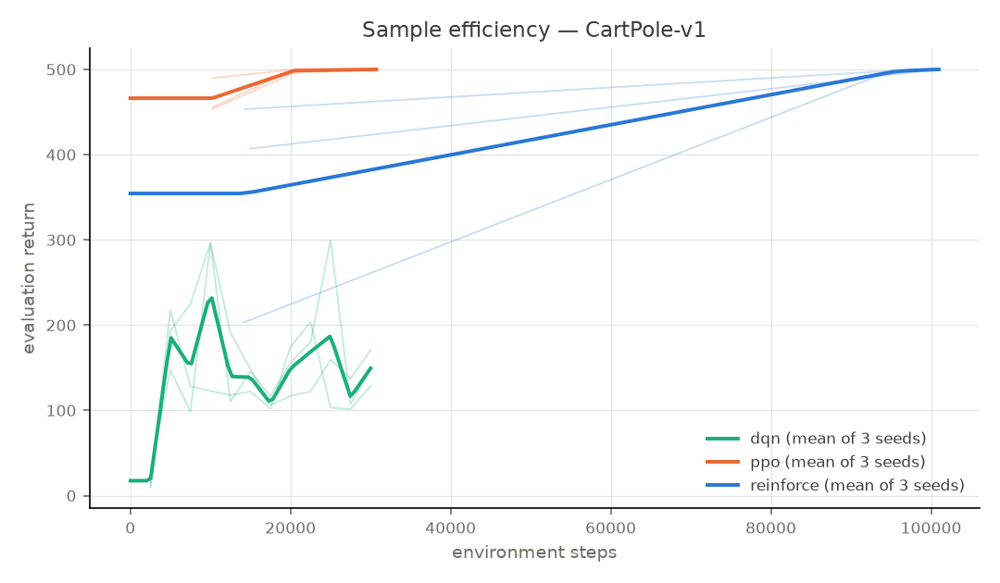
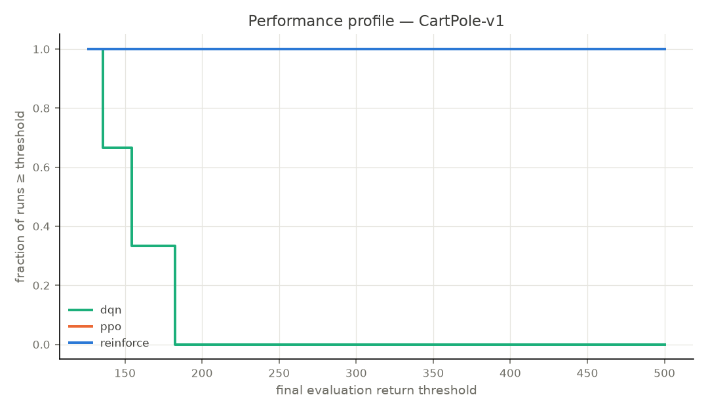
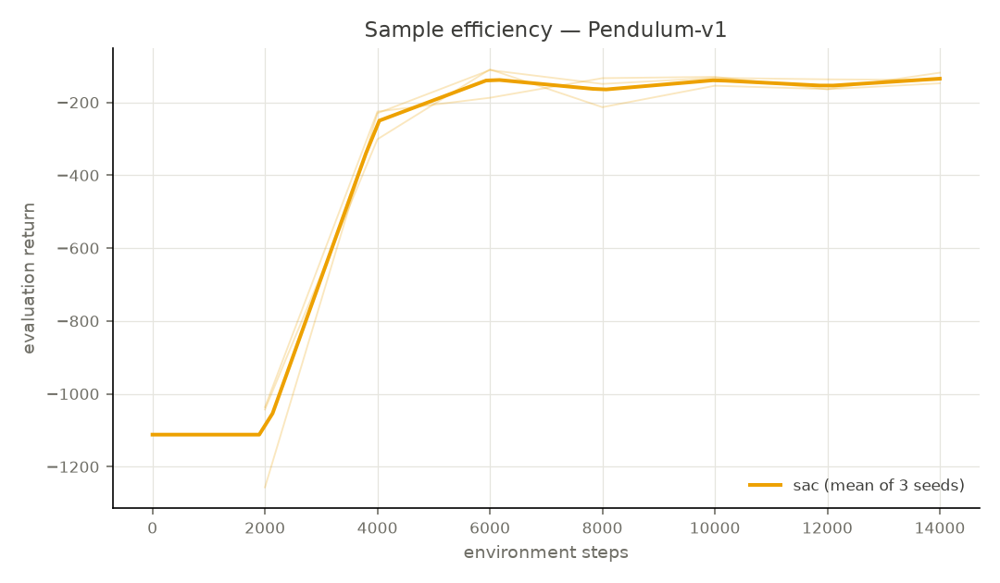
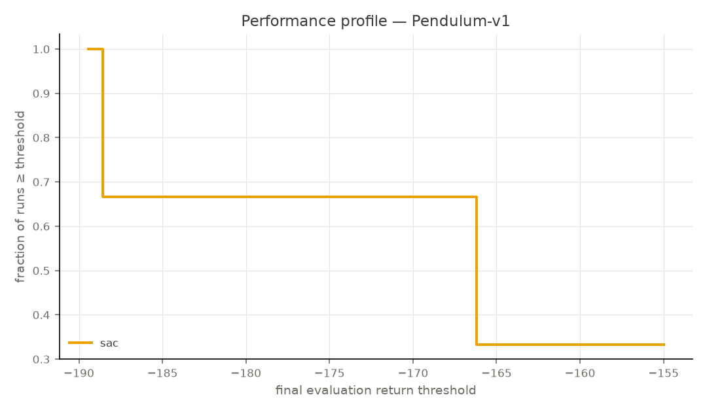

# Benchmark report: m7-classic-control

**Scope.** Fixed-budget engineering benchmark on the environments and
budgets listed in `manifest.json`. Statistics follow the protocol of
Agarwal et al. (NeurIPS 2021) computed by `rlcore.stats` (native,
tested implementation). Small-sample caveat: with these seed counts,
bootstrap intervals are rough uncertainty indicators. Environments
differ per algorithm family (discrete vs continuous action spaces),
so cross-*environment* rows are not comparable to each other.

## Run status census

| Status | Count |
|---|---|
| ok | 12 |

## Environment

- rlcore: `0.0.1`
- python: `3.11.15`
- torch: `2.13.0+cu130`
- gymnasium: `1.3.0`
- numpy: `2.4.6`
- hydra: `1.3.4`
- platform: `Linux-6.18.5-x86_64-with-glibc2.39`
- machine: `x86_64`
- device: `cpu`
- cuda_available: `False`
- commit: `708de42a0322e3d1c80c9ba02184cbc53228b1e4`
- git_dirty: `False`

## CartPole-v1

| Algorithm | Seeds | Mean | Median | IQM [95% bootstrap CI] | Min | Max |
|---|---|---|---|---|---|---|
| dqn | 3 | 150.7 | 148.7 | 150.7 [126.4, 177.1] | 126.4 | 177.1 |
| ppo | 3 | 500.0 | 500.0 | 500.0 [500.0, 500.0] | 500.0 | 500.0 |
| reinforce | 3 | 500.0 | 500.0 | 500.0 [500.0, 500.0] | 500.0 | 500.0 |

Pairwise probability of improvement (descriptive; no
significance claim at these sample sizes):

- P(dqn > ppo): 0.0
- P(dqn > reinforce): 0.0
- P(ppo > dqn): 1.0
- P(ppo > reinforce): 0.5
- P(reinforce > dqn): 1.0
- P(reinforce > ppo): 0.5

## Pendulum-v1

| Algorithm | Seeds | Mean | Median | IQM [95% bootstrap CI] | Min | Max |
|---|---|---|---|---|---|---|
| sac | 3 | -170.4 | -166.7 | -170.4 [-189.4, -155.0] | -189.4 | -155.0 |

