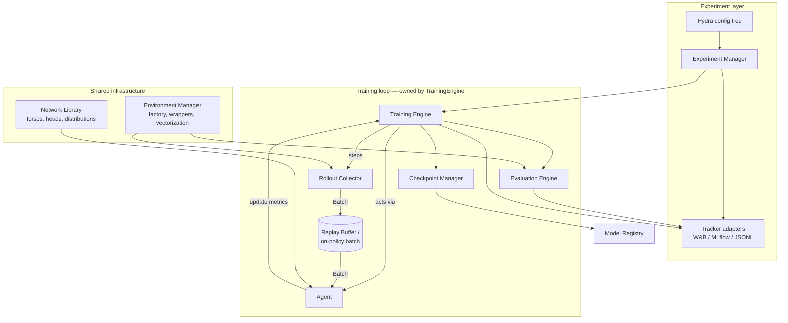

# Architecture

**Status:** Proposal — awaiting review
**Scope:** System design for the RL research platform: principles, prior art,
components, interfaces, repository layout, testing strategy, and risks.
Milestones and phase plans live in [`ROADMAP.md`](ROADMAP.md).

---

## 1. What we are building, and what we are not

We are building a **research platform**: a codebase whose primary users run
experiments, implement algorithm variants, and compare methods fairly. This is
a different artifact from a *product library* (SB3: stable API, hides
internals) and from a *tutorial* (Spinning Up, CleanRL: optimized for reading
one file once).

Consequences of that choice:

- **The unit of work is the experiment, not the API call.** Reproducibility
  (seeds, configs, code version) and fair comparison (identical evaluation
  protocols, aggregate statistics across seeds) are core features, not
  add-ons.
- **Algorithm code must stay legible.** A researcher modifying PPO's advantage
  estimation should edit one obvious file, not trace an inheritance chain.
- **Infrastructure must be boring.** Environment handling, logging,
  checkpointing, and data plumbing get built once, tested hard, and then
  trusted — because most RL bugs live there, silently.

## 2. Lessons from prior art

The design below is a deliberate response to existing frameworks. This matters
because RL framework design has a well-documented failure mode: abstraction
layers that make simple things hard and novel things impossible.

| Framework | What it gets right | What we avoid |
|---|---|---|
| **CleanRL** | Single-file algorithms; every line visible; excellent reproducibility culture (tracked runs, seeds) | No shared infrastructure — every file re-implements buffers, logging, eval; copy-paste divergence makes fair comparison hard |
| **Stable-Baselines3** | Reliability; battle-tested correctness; good docs | Monolithic `BaseAlgorithm` owns the training loop; extending an algorithm means subclassing and overriding private-ish methods; research velocity suffers |
| **Tianshou** | Modular collector/buffer/policy separation | Deep class hierarchies in places; policy objects accumulate responsibilities |
| **Acme (DeepMind)** | Clean actor/learner split that scales to distributed | Heavy framework machinery; steep entry cost for single-machine research |
| **RLlib** | Industrial scale | The cautionary tale: so many abstraction layers that debugging a loss function requires understanding a distributed execution model |
| **TorchRL** | Composable primitives, `TensorDict` data model | Fast-moving API; adopting it wholesale outsources our core data model to a dependency we don't control |

**Synthesis — our position:** *shared, hardened infrastructure* (envs, data,
nets, logging, eval) + *flat, legible algorithm modules* (each algorithm is a
small package of plain functions and one agent class you can read
top-to-bottom). Composition over inheritance everywhere.

## 3. Design principles

1. **Interfaces are `Protocol`s, not base classes.** Components interact
   through small structural interfaces (duck typing, checked by mypy). No
   mandatory inheritance; any object with the right methods plugs in. This is
   what makes "everything replaceable" real rather than aspirational.
2. **The training loop is owned by the engine, not the agent.** SB3's
   `model.learn()` couples algorithm, loop, logging, and eval into one object.
   We invert it: the `TrainingEngine` orchestrates *collect → update → log →
   eval → checkpoint*; the agent only knows how to act and how to update from
   a batch. This single decision is what makes algorithms swappable and the
   loop instrumentable.
3. **Rule of two.** No abstraction is introduced until the second concrete
   use exists or is scheduled on the roadmap. This is the guardrail against
   the RLlib failure mode.
4. **Determinism is a feature.** Every run is reproducible from
   `(config, git SHA, seed)`. Seeding is centralized; RNG state is part of
   checkpoints; CPU-deterministic tests are the bar (GPU determinism
   documented as best-effort, per PyTorch's own guarantees).
5. **Verify against references, numerically.** For each algorithm we test
   *loss-level parity* with Stable-Baselines3 (same synthetic batch in → same
   loss out, to numerical tolerance), not just "similar learning curves."
   Curve similarity is a weak, expensive signal; loss parity is exact and
   fast.
6. **Single-machine first, scale-ready by design.** No distributed code until
   Milestone 8, but the seams for it are chosen now: the actor/learner split
   (policy vs. agent), serializable configs, and functional collectors are
   exactly the seams distributed RL needs (this is the Acme lesson, taken
   without the machinery).
7. **Statistics or it didn't happen.** Cross-algorithm claims use the
   rliable protocol (Agarwal et al., NeurIPS 2021): interquartile mean,
   bootstrap CIs, performance profiles across seeds — never single-seed
   curves.

## 4. System overview



Data flows through one typed structure — `Batch` — from collection to update.
On-policy algorithms consume the collector's output directly; off-policy
algorithms route it through a replay buffer. Same type, same code paths, same
tests.

## 5. Core data model: `Batch`

A minimal, typed, dict-like container of tensors with attribute access,
`.to(device)`, length, slicing, and minibatch iteration. Roughly 150 lines,
exhaustively tested. Canonical keys are documented constants
(`obs`, `action`, `reward`, `terminated`, `truncated`, `next_obs`,
`logprob`, `value`, …); algorithms may add keys.

**Decision — custom `Batch` over TorchRL's `TensorDict`:**

- *For custom:* zero heavyweight dependencies; every line understood (this is
  also a learning platform); stable under our control; trivial to serialize.
- *For TensorDict:* free nested structures, memory-mapped storage, ecosystem
  momentum.
- *Recommendation:* custom for v1. The interface is small enough that
  migrating to TensorDict later, if nested/multi-agent needs arrive, is a
  mechanical change confined to `rlab/types.py` and buffer internals. Revisit
  at Milestone 8.

**Termination semantics** are fixed at this layer, once: Gymnasium's
`terminated` (MDP-true absorbing state → bootstrap value 0) vs. `truncated`
(time-limit cutoff → bootstrap from value function) are distinct fields end to
end. Conflating them is the single most common silent bug in RL codebases and
measurably changes results on time-limited tasks (Pardo et al., 2018).

## 6. Components and interfaces

Interface sketches below are architectural contracts, not implementations.
Signatures will be fully typed in code.

### 6.1 Environment Manager — `rlab.envs`

Everything that touches the Gymnasium API lives here, so API churn is
quarantined to one module.

- `make_env(cfg) -> gym.Env` factory driven by Hydra config; wrapper stack
  declared in config (order matters and is therefore explicit).
- Vectorization via Gymnasium's `SyncVectorEnv` / `AsyncVectorEnv` behind our
  own thin `VecEnv` seam (so a custom, faster vectorizer can replace it later
  without touching collectors).
- Normalization wrappers (observation/reward running statistics) whose state
  is **saved with checkpoints and frozen during evaluation** — normalization
  leakage between train and eval is another classic silent bug.
- Central seeding: one seed in the config fans out deterministically to envs,
  torch, numpy, and Python `random`.

### 6.2 Agent Interface — `rlab.agents`

Two protocols, deliberately separated:

```python
class Policy(Protocol):          # inference only — what an actor/evaluator needs
    def act(self, obs: Tensor, *, deterministic: bool = False) -> PolicyOutput: ...

class Agent(Policy, Protocol):   # learning — what the training engine needs
    def update(self, batch: Batch) -> dict[str, float]: ...   # returns metrics
    def state_dict(self) -> dict: ...
    def load_state_dict(self, state: dict) -> None: ...
```

`PolicyOutput` carries the action plus algorithm-specific extras (log-prob,
value estimate) that the collector stores into the `Batch`. The Policy/Agent
split is what lets the Evaluation Engine, and later distributed actors, hold
only inference capability.

Each algorithm is a flat package — e.g. `rlab/agents/ppo/` containing
`agent.py` (the class), `loss.py` (pure functions: policy loss, value loss,
GAE lives in `rlab.data.transforms` since A2C shares it), and `config.py`
(a dataclass registered with Hydra). Pure loss functions are independently
unit-testable and parity-testable against SB3.

### 6.3 Neural Network Library — `rlab.nets`

- **Torsos:** MLP, Nature-CNN (Mnih et al., 2015); interface takes an
  observation space, returns a feature tensor.
- **Heads:** categorical policy, diagonal Gaussian policy (with optional tanh
  squashing *and the corresponding log-prob correction* — omitting the
  correction is the classic SAC bug), state-value, Q-value, dueling Q.
- **Distributions:** thin wrappers over `torch.distributions` fixing
  shape/`log_prob` conventions once.
- **Initialization:** orthogonal init with per-layer gains as the default for
  policy networks — an empirically load-bearing detail for PPO
  (Engstrom et al., ICLR 2020, "Implementation Matters").

### 6.4 Data path — `rlab.data`

- **`RolloutCollector`:** steps a `VecEnv` with a `Policy` for *n* steps,
  returns a time-major `Batch`. Owns correct handling of autoreset,
  terminal-observation bookkeeping, and the terminated/truncated distinction.
- **`ReplayBuffer` protocol** with a uniform ring-buffer implementation
  first; the interface (`add(batch)`, `sample(n) -> Batch`) is chosen so
  prioritized replay (sum-tree, importance weights) is a drop-in second
  implementation (rule of two: scheduled, Milestone 6+).
- **Transforms:** pure functions over `Batch` — GAE (Schulman et al., 2016),
  n-step returns, return normalization. Pure functions here mean invariant
  tests are trivial (e.g. GAE with λ=1, γ=1 must equal Monte-Carlo returns).

### 6.5 Training Engine — `rlab.training`

The single place where the loop lives:

```
for iteration in ...:
    data    = collect(...)            # or buffer.sample(...)
    metrics = agent.update(data)
    hooks: on_iteration_end → logging, evaluation (scheduled), checkpointing (scheduled)
```

A **small, fixed set of hook points** (iteration end, eval end, checkpoint
saved) rather than an open callback bus — callbacks are where frameworks
accumulate hidden control flow. Anything needing more than these hooks should
be a different engine (the engine itself is behind a protocol and thus
replaceable — e.g. a future distributed engine).

### 6.6 Evaluation Engine — `rlab.evaluation`

- Evaluation runs on **separate env instances with fixed eval seeds**, frozen
  normalization statistics, and both deterministic and stochastic action
  modes (reported separately — they answer different questions).
- Aggregate metrics module implementing the rliable protocol: IQM, optimality
  gap, stratified bootstrap CIs, performance profiles. This is what
  "compare algorithms fairly" means operationally.

### 6.7 Experiment Manager — `rlab.experiments`

- **Run identity:** every run gets a directory containing the resolved Hydra
  config, git SHA + dirty-diff patch, seed, environment/package versions, and
  metrics as JSONL. A run is reproducible from its directory alone, with no
  tracker account.
- **`Tracker` protocol** (`log_scalars`, `log_video`, `log_artifact`, …) with
  three adapters: W&B (primary), MLflow, and an offline JSONL/TensorBoard
  fallback. The protocol keeps us vendor-independent; W&B is recommended as
  primary for research UX (free academic tier, sweep UI, report sharing).

### 6.8 Hyperparameter system — Hydra

- Config tree under `configs/` composed by group: `algo/`, `env/`, `train/`,
  `eval/`, `track/`. Structured configs (dataclasses) so mypy and Hydra both
  validate them; defaults encode *published* hyperparameters with citations
  in comments.
- Sweeps via Hydra multirun from day one; Optuna sweeper plugin when we reach
  systematic tuning (Milestone 7).

### 6.9 Checkpoint Manager & Model Registry — `rlab.checkpoints`

- Checkpoints are **complete**: model, optimizer, schedulers, buffer cursor,
  env normalization statistics, RNG states (torch/numpy/python/env), and
  step counters. Resume must be bit-exact on CPU; anything less makes
  preemption-safe cloud training impossible.
- Atomic writes (write temp, fsync, rename), retention policy (last k +
  best-by-eval-metric).
- Registry = a small metadata index (JSON) mapping `(algo, env, config hash)`
  → best checkpoints, so benchmark tables and "load the best PPO for
  HalfCheetah" are queries, not folder spelunking.

### 6.10 Visualization — `rlab.viz`

Publication-grade learning curves (mean/IQM with CI bands across seeds) from
run directories or tracker exports; rollout video recording via the eval
engine. The W&B dashboard covers interactive monitoring; this module covers
*paper figures*, which dashboards do badly.

### 6.11 Research Module — `rlab.research`

Deliberately the **last** component (Milestone 8): ablation harness (declare a
base config + a set of deltas, get a full comparison with rliable stats),
algorithm-variant registry. Its shape should be dictated by friction we
actually experience running studies with the platform — designing it first
would be speculation.

## 7. Repository layout

```
ai-research-lab/
├── pyproject.toml              # single source: deps, ruff, mypy, pytest config
├── README.md
├── LICENSE                     # proposal: Apache-2.0 (see Open Decisions)
├── .github/workflows/ci.yml    # lint → type-check → unit tests (CPU)
├── .pre-commit-config.yaml
├── docker/
│   └── Dockerfile              # CPU dev image now; CUDA variant at Milestone 8
├── configs/                    # Hydra tree
│   ├── config.yaml             # root defaults
│   ├── algo/                   # ppo.yaml, dqn.yaml, sac.yaml, ...
│   ├── env/                    # cartpole.yaml, halfcheetah.yaml, ...
│   ├── train/                  # loop settings, schedules
│   ├── eval/                   # protocols
│   └── track/                  # wandb.yaml, mlflow.yaml, offline.yaml
├── src/rlab/
│   ├── types.py                # Batch, PolicyOutput, key constants
│   ├── envs/                   # factory, wrappers, vector seam, seeding
│   ├── nets/                   # torsos, heads, distributions, init
│   ├── data/                   # collector, replay buffers, transforms
│   ├── agents/                 # base protocols + ppo/, dqn/, sac/, ...
│   ├── training/               # engine, schedules
│   ├── evaluation/             # evaluator, rliable-style metrics
│   ├── experiments/            # run manager, tracker adapters
│   ├── checkpoints/            # manager, registry
│   ├── viz/                    # curves, video
│   └── utils/                  # timers, logging setup, device
├── tests/
│   ├── unit/                   # shapes, dtypes, gradient flow/blocking
│   ├── invariants/             # mathematical properties, determinism
│   ├── parity/                 # numerical parity vs SB3 (SB3 dep lives here)
│   └── smoke/                  # "learns CartPole" canaries (marked slow)
├── benchmarks/                 # full-run scripts + committed results tables
├── examples/                   # minimal end-to-end train scripts
└── docs/
    ├── ARCHITECTURE.md         # this file
    ├── ROADMAP.md
    └── design/                 # ADRs for future decisions
```

Notes:

- **`src/` layout** prevents accidentally importing the working tree instead
  of the installed package — a real class of CI bug.
- **SB3 is a test-only dependency** (an extras group installed in
  `tests/parity` contexts), keeping the runtime dependency tree lean and the
  "verification, not implementation" rule structurally enforced.
- Package name **`rlab`**: short, importable, matches the repo. Open to
  alternatives (see Open Decisions).

## 8. Testing strategy

Ordered from fast/always to slow/scheduled:

1. **Unit tests** — shapes, dtypes, edge cases; gradient *flow* where
   expected and gradient *blocking* where required (e.g. no gradient through
   target networks or GAE targets).
2. **Invariant tests** — mathematical properties: GAE(λ=1,γ=1) ≡ Monte-Carlo
   returns; buffer FIFO semantics; tanh-Gaussian `log_prob` matches numerical
   change-of-variables; two runs with the same seed produce identical weights
   after N updates (CPU).
3. **Parity tests** — our loss functions vs. SB3's on identical synthetic
   batches, `allclose` at tight tolerance. Exact, fast, and catches the bugs
   learning curves hide.
4. **Smoke tests** (`-m slow`) — tiny budget "learns at all" canaries:
   CartPole above a reward threshold in a few thousand steps. Probabilistic
   by nature, so thresholds are generous and seeds fixed.
5. **Benchmark suite** (manual/nightly, not CI) — full runs vs. published
   numbers, committed to `benchmarks/` with configs and seeds.

CI runs 1–3 on every push (CPU, minutes); 4 on PRs to main; 5 on demand.

## 9. Risks and mitigations

| Risk | Why it's real | Mitigation |
|---|---|---|
| **Over-abstraction** | Killed more RL frameworks than bugs have | Rule of two; protocols not base classes; flat algorithm packages; this doc as the reference to push back against |
| **Silent numerical bugs** | RL fails quietly — wrong code often still learns, just worse | Parity tests vs. SB3; invariant tests; a documented checklist of classic bugs (truncation bootstrapping, normalization leakage, tanh log-prob correction, GAE off-by-one) applied at every algorithm review |
| **Non-reproducibility** | GPU nondeterminism, hidden global RNG state | Central seeding; RNG in checkpoints; CPU determinism as the tested bar; `torch.use_deterministic_algorithms` documented for GPU |
| **Gymnasium API churn** | v0.29→1.x broke autoreset semantics for many codebases | All Gym touchpoints quarantined in `rlab.envs`; pinned versions; wrapper tests |
| **Scope creep** | The component list is large and tempting | Phase gates with your approval; Research Module explicitly deferred to last |
| **Benchmark compute cost** | Fair comparison needs many seeds | rliable small-sample statistics; tiered env suites (classic control → MuJoCo → Atari); benchmarks decoupled from CI |
| **Solo-maintainer bus factor** | Open-source release needs onboarding paths | Docs-as-you-go; ADRs for every decision of this kind; examples/ kept runnable |

## 10. Open decisions for review

1. **Package name:** `rlab` (proposed) — or your preference.
2. **License:** Apache-2.0 (proposed — explicit patent grant matters for a
   platform meant to host novel methods) vs. MIT (simpler; SB3/TorchRL use it).
3. **Tracker primary:** W&B (proposed) behind the `Tracker` protocol, with
   MLflow adapter scheduled — or MLflow-first if self-hosting is a
   requirement.
4. **Python/PyTorch floors:** Python ≥ 3.11, PyTorch ≥ 2.2 (proposed).
5. **`Batch`:** custom implementation (proposed) vs. adopting TensorDict now.
6. **First algorithm track:** REINFORCE → PPO before DQN (proposed; rationale
   in ROADMAP §Milestone 4).
