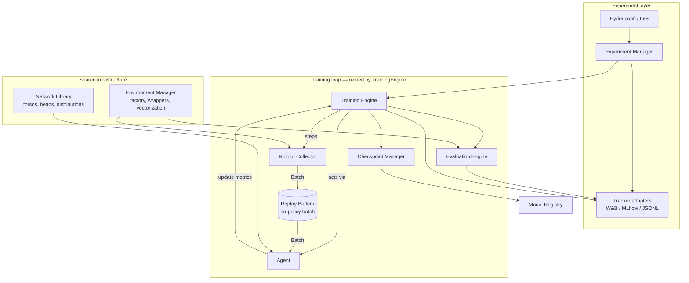

# Architecture

**Status:** Revision 2 — vision approved; incorporating review feedback
**Scope:** System design for the RL research platform: principles, prior art,
components, interfaces, repository layout, testing strategy, and risks.
Milestones and phase plans live in [`ROADMAP.md`](ROADMAP.md).

**Changes from revision 1 (review feedback):** package renamed to `rlcore`;
prior-art and design claims restated in measured terms; GAE invariant
corrected (λ=1 recovers the Monte-Carlo *advantage*, not the return);
checkpoint requirements expanded into a full specification; abstraction
policy changed to *extract from working algorithms* rather than design
up front — the component list below is the target architecture, and the
roadmap now reaches it through working algorithm code first.

---

## 1. What we are building, and what we are not

We are building a **research platform**: a codebase whose primary users run
experiments, implement algorithm variants, and compare methods fairly. This is
a different artifact from a *product library* (SB3: stable API, hides
internals) and from a *tutorial* (Spinning Up, CleanRL: optimized for reading
one file once).

Consequences of that choice:

- **The unit of work is the experiment, not the API call.** Reproducibility
  (seeds, configs, code version) and fair comparison (identical evaluation
  protocols, aggregate statistics across seeds) are core features, not
  add-ons.
- **Algorithm code must stay legible.** A researcher modifying PPO's advantage
  estimation should edit one obvious file, not trace an inheritance chain.
- **Infrastructure should be boring.** Environment handling, logging,
  checkpointing, and data plumbing get built once, tested hard, and then
  trusted — because data-handling bugs in RL are common and often silent.

### 1.1 The two-layer platform

The full system is two connected layers. Everything in §2–§9 of this document
specifies the **execution layer**; the **research intelligence layer** is a
later, separately reviewed addition (roadmap M8–M9) that operates *on top of*
the execution layer's artifacts:

```
┌─────────────────────────────────────────────────────────────┐
│  Research intelligence layer (M8–M9)                        │
│  paper index & notes · research memory · hypothesis and     │
│  experiment-plan registry · results analysis · reports      │
│  with evidence & citations · LLM-assisted review/critique   │
└──────────────────────────┬──────────────────────────────────┘
              reads runs, configs, metrics, checkpoints
              writes experiment plans, analyses, reports
┌──────────────────────────┴──────────────────────────────────┐
│  Execution layer (M0–M7, this document)                     │
│  envs · agents · training · buffers · configs ·             │
│  checkpoints · tracking · statistics · benchmarks           │
└─────────────────────────────────────────────────────────────┘
```

The target research flow: *research question → literature review → hypothesis
→ experiment design → algorithm implementation → training runs → statistical
analysis → research conclusion → persistent research memory* — where the
middle segment (implementation → runs → analysis) is exactly what the
execution layer automates, and the outer segments are what the intelligence
layer supports.

Two design commitments, made now so the execution layer grows the right
seams:

1. **Research artifacts are structured data, not prose in a wiki.** Papers,
   notes, hypotheses, experiment plans, and conclusions get typed schemas and
   live in the repository (or a database it manages), linked by ID to the
   runs, configs, and checkpoints that support them. The experiment
   registry/run-directory design (§6.7) is therefore the junction point
   between layers, and every run is attributable to a plan and citable in a
   report.
2. **Evidence discipline is enforced at the layer boundary.** A report may
   only claim what its linked runs and statistics support; LLM-assisted
   components (explanation, critique, literature synthesis, draft analysis)
   assist a human researcher and must cite their sources — run IDs, paper
   references — rather than assert from memory. Hypothesis generation and
   gap identification are human-led with tool support; this is a platform
   requirement (see Quality Requirements in the project brief), not an
   aspiration.

The intelligence layer's detailed architecture is deliberately *not*
specified here — per principle 3 (extract, don't design up front), it binds
at its own milestone reviews, informed by the research workflows we actually
run with the execution layer in M1–M7.

## 2. Lessons from prior art

The design below draws on existing frameworks, all of which are good at what
they were built for. The observations here are about fit for *our* use case —
single-machine-first research with legible algorithm code — not about quality.
The recurring tension they illustrate: abstraction that aids reuse can also
obscure algorithm logic, and each framework resolves that trade-off
differently.

| Framework | Strengths | Trade-off for our use case |
|---|---|---|
| **CleanRL** | Single-file algorithms; every line visible; strong reproducibility culture (tracked runs, seeds) | Little shared infrastructure by design — buffers, logging, and eval are re-implemented per file, which makes cross-algorithm comparison and shared fixes harder |
| **Stable-Baselines3** | Reliability; battle-tested correctness; good docs | Designed for a stable *user-facing* API rather than easy internal modification; `model.learn()` couples algorithm, loop, logging, and eval — the right trade-off for its users, less so for algorithm research |
| **Tianshou** | Modular collector/buffer/policy separation | Policy objects carry several responsibilities; extension often goes through subclassing |
| **Acme (DeepMind)** | Clean actor/learner split that scales to distributed | Framework machinery adds entry cost for single-machine research |
| **RLlib** | Industrial scale and breadth | Generality and distributed execution add layers between a researcher and a loss function; iteration on algorithm internals is slower |
| **TorchRL** | Composable primitives, `TensorDict` data model | Adopting it wholesale would outsource our core data model to a still-evolving dependency |

**Synthesis — our position:** *shared, tested infrastructure* (envs, data,
nets, logging, eval) + *flat, legible algorithm modules* (each algorithm a
small package of plain functions and one agent class readable top-to-bottom).
Composition over inheritance wherever possible.

## 3. Design principles

1. **Interfaces are `Protocol`s, not base classes.** Components interact
   through small structural interfaces (duck typing, checked by mypy). No
   mandatory inheritance; any object with the right methods plugs in. This
   keeps "replaceable through interfaces" enforceable by the type checker.
2. **The training loop is owned by the engine, not the agent.** The
   `TrainingEngine` orchestrates *collect → update → log → eval →
   checkpoint*; the agent only knows how to act and how to update from a
   batch. This separation is what makes algorithms swappable and the loop
   instrumentable.
3. **Abstractions are extracted, not designed up front.** The component
   architecture in §6 is the *target*. We reach it by building working
   algorithms first — with plumbing inlined where that is clearer — and
   extracting shared infrastructure only once two implementations exercise
   it (the "rule of two"). An interface is a draft until its second consumer
   exists. The roadmap sequences this explicitly.
4. **Determinism is a feature — with a narrowly stated guarantee.** Seeding
   is centralized (`seed_everything` establishes controlled random streams),
   and RNG state is part of checkpoints. Controlled streams alone do not make
   training deterministic: full run determinism additionally depends on
   deterministic PyTorch operations, hardware, environment behavior,
   threading, and pinned software versions. The claim we test is therefore
   same-machine CPU reproducibility from `(config, git SHA, seed)` with the
   locked dependency set; GPU determinism is best-effort per PyTorch's own
   guarantees, with `torch.use_deterministic_algorithms` as a documented
   opt-in.
5. **Verify against references, numerically.** For each algorithm we test
   *loss-level parity* with Stable-Baselines3 (same synthetic batch in → same
   loss out, to numerical tolerance), not just "similar learning curves."
   Curve similarity is a weak, expensive signal; loss parity is exact and
   fast.
6. **Single-machine first, scale-ready by design.** No distributed code until
   the final milestone, but the seams for it are chosen now: the
   actor/learner split (policy vs. agent), serializable configs, and
   functional collectors are the seams distributed RL needs (the Acme
   lesson, without the machinery).
7. **Statistics or it didn't happen.** Cross-algorithm claims use the
   rliable protocol (Agarwal et al., NeurIPS 2021): interquartile mean,
   bootstrap CIs, performance profiles across seeds — never single-seed
   curves.

## 4. System overview



Data flows through one typed structure — `Batch` — from collection to update.
On-policy algorithms consume the collector's output directly; off-policy
algorithms route it through a replay buffer. Same type, same code paths, same
tests.

## 5. Core data model: `Batch`

A minimal, typed, dict-like container of tensors with attribute access,
`.to(device)`, length, slicing, and minibatch iteration. Roughly 150 lines,
exhaustively tested. `Batch` v1 is a **deliberately narrow abstraction** — a
flat container of same-length, same-device tensors, not the platform's final
universal RL data model; nested observations, sequence/recurrent layouts, and
multi-agent structures are explicitly out of its scope and get revisited
against real requirements at the decision point below. Canonical keys are
documented constants
(`obs`, `action`, `reward`, `terminated`, `truncated`, `next_obs`,
`logprob`, `value`, …); algorithms may add keys.

**Decision — custom `Batch` over TorchRL's `TensorDict`:**

- *For custom:* no heavyweight dependency; every line understood (this is
  also a learning platform); stable under our control; trivial to serialize.
- *For TensorDict:* free nested structures, memory-mapped storage, ecosystem
  momentum.
- *Decision:* custom for v1. The interface is small enough that migrating to
  TensorDict later, if nested/multi-agent needs arrive, is a mechanical
  change confined to `rlcore/types.py` and buffer internals. Revisit at the
  scale milestone (M7).

**Termination semantics** are fixed at this layer, once: Gymnasium's
`terminated` (MDP-true absorbing state → bootstrap value 0) vs. `truncated`
(time-limit cutoff → bootstrap from value function) are distinct fields end to
end. Conflating them is a common, hard-to-detect error that measurably changes
results on time-limited tasks (Pardo et al., 2018).

## 6. Components and interfaces

Interface sketches below are architectural contracts, not implementations.
Per principle 3, each component is *finalized* only when working algorithm
code exercises it; until then it is a design target.

### 6.1 Environment Manager — `rlcore.envs`

Everything that touches the Gymnasium API lives here, so API churn is
quarantined to one module.

- `make_env(cfg) -> gym.Env` factory driven by Hydra config; wrapper stack
  declared in config (order matters and is therefore explicit).
- Vectorization via Gymnasium's `SyncVectorEnv` / `AsyncVectorEnv` behind our
  own thin `VecEnv` seam (so a custom vectorizer can replace it later without
  touching collectors).
- Normalization wrappers (observation/reward running statistics) whose state
  is **saved with checkpoints and frozen during evaluation** — normalization
  leakage between train and eval is another common silent error.
- Central seeding: one seed in the config fans out deterministically to envs,
  torch, numpy, and Python `random`.

### 6.2 Agent Interface — `rlcore.agents`

Two protocols, deliberately separated:

```python
class Policy(Protocol):          # inference only — what an actor/evaluator needs
    def act(self, obs: Tensor, *, deterministic: bool = False) -> PolicyOutput: ...

class Agent(Policy, Protocol):   # learning — what the training engine needs
    def update(self, batch: Batch) -> dict[str, float]: ...   # returns metrics
    def state_dict(self) -> dict: ...
    def load_state_dict(self, state: dict) -> None: ...
```

`PolicyOutput` carries the action plus algorithm-specific extras (log-prob,
value estimate) that the collector stores into the `Batch`. The Policy/Agent
split lets the Evaluation Engine, and later distributed actors, hold only
inference capability.

Each algorithm is a flat package — e.g. `rlcore/agents/ppo/` containing
`agent.py` (the class), `loss.py` (pure functions: policy loss, value loss;
GAE lives in `rlcore.data.transforms` since multiple algorithms share it),
and `config.py` (a dataclass registered with Hydra). Pure loss functions are
independently unit-testable and parity-testable against SB3.

### 6.3 Neural Network Library — `rlcore.nets`

- **Torsos:** MLP, Nature-CNN (Mnih et al., 2015); interface takes an
  observation space, returns a feature tensor.
- **Heads:** categorical policy, diagonal Gaussian policy (with optional tanh
  squashing *and the corresponding log-prob correction* — omitting the
  correction is a well-documented implementation error in SAC-style
  algorithms), state-value, Q-value, dueling Q.
- **Distributions:** thin wrappers over `torch.distributions` fixing
  shape/`log_prob` conventions once.
- **Initialization:** orthogonal init with per-layer gains as the default for
  policy networks — an empirically important detail for PPO
  (Engstrom et al., ICLR 2020, "Implementation Matters").

### 6.4 Data path — `rlcore.data`

- **`RolloutCollector`:** steps a `VecEnv` with a `Policy` for *n* steps,
  returns a time-major `Batch`. Owns correct handling of autoreset,
  terminal-observation bookkeeping, and the terminated/truncated distinction.
- **`ReplayBuffer` protocol** with a uniform ring-buffer implementation
  first — built when the first off-policy algorithm needs it, not before.
  The interface (`add(batch)`, `sample(n) -> Batch`) is chosen so
  prioritized replay (sum-tree, importance weights) can be a drop-in second
  implementation later.
- **Transforms:** pure functions over `Batch` — GAE (Schulman et al., 2016),
  n-step returns, return normalization. Pure functions make invariant tests
  direct. The GAE invariants (corrected from revision 1):
  - **λ = 0:** the advantage reduces to the one-step TD residual,
    `Â_t = r_t + γ·V(s_{t+1}) − V(s_t)`.
  - **λ = 1, any γ:** the sum telescopes, so the advantage equals the
    discounted Monte-Carlo return minus the value baseline,
    `Â_t = G_t − V(s_t)` — equivalently, `Â_t + V(s_t)` reproduces the
    discounted Monte-Carlo return `G_t`. (Revision 1 wrongly claimed the
    *advantage itself* equals the MC return.)
  - Both limits are tested against direct reference computation, including
    bootstrapped values at truncation boundaries.

### 6.5 Training Engine — `rlcore.training`

The single place where the loop lives:

```
for iteration in ...:
    data    = collect(...)            # or buffer.sample(...)
    metrics = agent.update(data)
    hooks: on_iteration_end → logging, evaluation (scheduled), checkpointing (scheduled)
```

A **small, fixed set of hook points** (iteration end, eval end, checkpoint
saved) rather than an open callback bus — open callback systems tend to
accumulate hidden control flow over time. Anything needing more than these
hooks should be a different engine (the engine itself is behind a protocol
and thus replaceable — e.g. a future distributed engine).

### 6.6 Evaluation Engine — `rlcore.evaluation`

- Evaluation runs on **separate env instances with fixed eval seeds**, frozen
  normalization statistics, and both deterministic and stochastic action
  modes (reported separately — they answer different questions).
- Aggregate metrics module implementing the rliable protocol: IQM, optimality
  gap, stratified bootstrap CIs, performance profiles. This is what
  "compare algorithms fairly" means operationally.

### 6.7 Experiment Manager — `rlcore.experiments`

- **Run identity:** every run gets a directory containing the resolved Hydra
  config, git SHA + dirty-diff patch, seed, environment/package versions, and
  metrics as JSONL. A run is reproducible from its directory alone, with no
  tracker account.
- **`Tracker` protocol** (`log_scalars`, `log_video`, `log_artifact`, …) with
  three adapters: W&B (primary), MLflow, and an offline JSONL/TensorBoard
  fallback. The protocol keeps us vendor-independent; W&B is the recommended
  primary for research UX (free academic tier, sweep UI, report sharing).

### 6.8 Hyperparameter system — Hydra

- Config tree under `configs/` composed by group: `algo/`, `env/`, `train/`,
  `eval/`, `track/`. Structured configs (dataclasses) so mypy and Hydra both
  validate them; defaults encode *published* hyperparameters with citations
  in comments.
- Sweeps via Hydra multirun; Optuna sweeper plugin when we reach systematic
  tuning (M6).

### 6.9 Checkpoint Manager & Model Registry — `rlcore.checkpoints`

Checkpointing is specified as a contract, because incomplete checkpoints are
the difference between "can resume" and "can resume *exactly*" — and
preemption-safe cloud training requires the latter. A checkpoint MUST
contain:

1. **Learner state** — model parameters; optimizer state; LR/entropy/clip
   schedule states; AMP grad-scaler state when mixed precision is active.
2. **Algorithm state** — target networks; auxiliary networks; learned
   temperature/coefficients (e.g. SAC's α); update counters that drive
   target syncs.
3. **Data state** — for off-policy runs, the replay buffer *contents* and
   cursor, not just the cursor. Buffer serialization is the default (exact
   resume); a documented lightweight mode may omit it, in which case the
   checkpoint is explicitly marked non-exact. On-policy runs carry no
   persistent data state.
4. **Environment state** — observation/reward normalization running
   statistics; env seed ledger and episode counters. Boundary condition,
   stated honestly: third-party env internals are generally not
   serializable, so resume guarantees are defined **at iteration
   boundaries** — on restore, envs are re-created and re-seeded from the
   ledger. Mid-episode simulator state is not restored, and the docs say so.
5. **RNG state** — torch CPU and CUDA generators, numpy, Python `random`,
   and env/action-space RNGs.
6. **Progress and identity** — global env step, update count, episode count,
   wall-clock; the resolved config, git SHA (plus dirty-diff patch), and
   package versions; the tracker run ID, so logging resumes into the same
   run rather than forking a new one.
7. **Format, integrity, portability** — a versioned schema with an explicit
   migration policy (a checkpoint written by schema version N either loads
   under N+1 or fails loudly with a clear message — never silently
   partially-loads); atomic writes (temp file → fsync → rename); a checksum
   manifest; `map_location`-style cross-device restore (train on GPU,
   restore on CPU).
8. **Retention and registry** — last-*k* plus best-by-eval-metric retention;
   the registry is a small metadata index (JSON) mapping
   `(algo, env, config hash)` → best checkpoints, so "load the best PPO for
   HalfCheetah" is a query, not folder spelunking.

**Acceptance test (the definition of "works"):** train for 2N iterations
continuously; separately train N iterations, checkpoint, restore in a fresh
process, train N more. On CPU, final weights must be identical for on-policy
algorithms, and for off-policy algorithms with buffer serialization enabled.

### 6.10 Visualization — `rlcore.viz`

Publication-grade learning curves (mean/IQM with CI bands across seeds) from
run directories or tracker exports; rollout video recording via the eval
engine. The W&B dashboard covers interactive monitoring; this module covers
*paper figures*, which dashboards handle poorly.

### 6.11 Research Module — `rlcore.research`

Deliberately the **last** component (M7): ablation harness (declare a base
config + a set of deltas, get a full comparison with rliable stats),
algorithm-variant registry. Its shape should be dictated by friction we
actually experience running studies with the platform — designing it first
would be speculation.

## 7. Repository layout

Target layout; directories marked *(later)* are created by the milestone that
needs them, not up front.

```
ai-research-lab/
├── pyproject.toml              # single source: deps, ruff, mypy, pytest config
├── README.md
├── LICENSE                     # Apache-2.0
├── .github/workflows/ci.yml    # lint → type-check → unit tests (CPU)
├── docker/                     # (later, M6) reproducible benchmark image
├── configs/                    # Hydra tree (starts minimal at M1)
│   ├── config.yaml
│   ├── algo/                   # ppo.yaml, dqn.yaml, sac.yaml, ...
│   ├── env/                    # cartpole.yaml, halfcheetah.yaml, ...
│   ├── train/                  # loop settings, schedules
│   ├── eval/                   # protocols            (later, M4)
│   └── track/                  # wandb.yaml, ...      (later, M4)
├── src/rlcore/
│   ├── types.py                # Batch, PolicyOutput, key constants
│   ├── envs/                   # factory, wrappers, vector seam, seeding
│   ├── nets/                   # torsos, heads, distributions, init
│   ├── data/                   # collector, transforms; replay buffers (later, M5)
│   ├── agents/                 # base protocols + reinforce/, ppo/, dqn/, sac/
│   ├── training/               # engine, schedules   (extracted at M3)
│   ├── evaluation/             # evaluator, metrics  (later, M4)
│   ├── experiments/            # run manager, trackers (later, M4)
│   ├── checkpoints/            # manager, registry   (later, M4)
│   ├── viz/                    # curves, video       (later, M4+)
│   └── utils/                  # seeding, logging setup
├── tests/
│   ├── unit/                   # shapes, dtypes, gradient flow/blocking
│   ├── invariants/             # mathematical properties, determinism
│   ├── parity/                 # numerical parity vs SB3 (SB3 dep lives here)
│   └── smoke/                  # "learns CartPole" canaries (marked slow)
├── benchmarks/                 # full-run scripts + committed results tables
├── examples/                   # minimal end-to-end train scripts
└── docs/
    ├── ARCHITECTURE.md         # this file
    ├── ROADMAP.md
    └── design/                 # ADRs
```

Notes:

- **`src/` layout** prevents accidentally importing the working tree instead
  of the installed package — a real class of CI bug.
- **SB3 is a test-only dependency** (an extras group used by `tests/parity`),
  keeping the runtime dependency tree lean and the "verification, not
  implementation" rule structurally enforced.
- Package name **`rlcore`** — verified free on PyPI (as are the runner-up
  candidates `rlbase` and `rlfoundry`; `rlab` and `rlforge` are taken).

## 8. Testing strategy

Ordered from fast/always to slow/scheduled:

1. **Unit tests** — shapes, dtypes, edge cases; gradient *flow* where
   expected and gradient *blocking* where required (e.g. no gradient through
   target networks or advantage targets).
2. **Invariant tests** — mathematical properties: the GAE limit identities of
   §6.4 (λ=0 → TD residual; λ=1 → MC return minus value baseline); buffer
   FIFO semantics; tanh-Gaussian `log_prob` matches numerical
   change-of-variables; two runs with the same seed produce identical
   weights after N updates (CPU).
3. **Parity tests** — our loss functions vs. SB3's on identical synthetic
   batches, `allclose` at tight tolerance. Exact, fast, and catches bugs that
   learning curves hide.
4. **Smoke tests** (`-m slow`) — tiny-budget "learns at all" canaries:
   CartPole above a reward threshold in a few thousand steps. Probabilistic
   by nature, so thresholds are generous and seeds fixed.
5. **Benchmark suite** (manual/nightly, not CI) — full runs vs. published
   numbers, committed to `benchmarks/` with configs and seeds.

CI runs 1–3 on every push (CPU, minutes); 4 on PRs to main; 5 on demand.

## 9. Risks and mitigations

| Risk | Why it's real | Mitigation |
|---|---|---|
| **Over-abstraction** | A recurring failure mode in prior RL frameworks | Extract-don't-design policy (§3.3); protocols not base classes; flat algorithm packages; this doc as the reference to push back against |
| **Silent numerical bugs** | RL often fails quietly — incorrect code can still learn, just worse | Parity tests vs. SB3; invariant tests; a documented checklist of known error classes (truncation bootstrapping, normalization leakage, tanh log-prob correction, GAE indexing) applied at every algorithm review |
| **Non-reproducibility** | GPU nondeterminism, hidden global RNG state | Central seeding; RNG in checkpoints; CPU determinism as the tested bar; `torch.use_deterministic_algorithms` documented for GPU |
| **Gymnasium API churn** | v0.29→1.x changed autoreset semantics for many codebases | All Gym touchpoints quarantined in `rlcore.envs`; pinned versions; wrapper tests |
| **Scope creep** | The component list is large and tempting | Phase gates with reviewer approval; algorithms before abstractions; Research Module explicitly deferred to last |
| **Benchmark compute cost** | Fair comparison needs many seeds | rliable small-sample statistics; tiered env suites (classic control → MuJoCo → Atari); benchmarks decoupled from CI |
| **Solo-maintainer bus factor** | Open-source release needs onboarding paths | Docs-as-you-go; ADRs for decisions of record; examples/ kept runnable |

## 10. Decisions of record

Ratified in the revision-1 review (revisitable via ADR):

1. **Package name:** `rlcore` (renamed from `rlab`, which is taken on PyPI).
2. **License:** Apache-2.0.
3. **Tracker:** W&B primary behind the `Tracker` protocol; MLflow adapter
   scheduled; offline JSONL/TensorBoard fallback always available.
4. **Floors:** Python ≥ 3.11, PyTorch ≥ 2.2.
5. **`Batch`:** custom implementation; TensorDict revisited at M7.
6. **Algorithm order:** REINFORCE → PPO (on-policy) before DQN → SAC
   (off-policy); abstractions extracted after working implementations exist.
